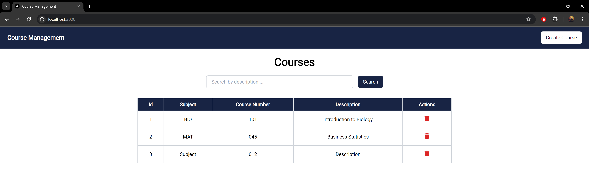
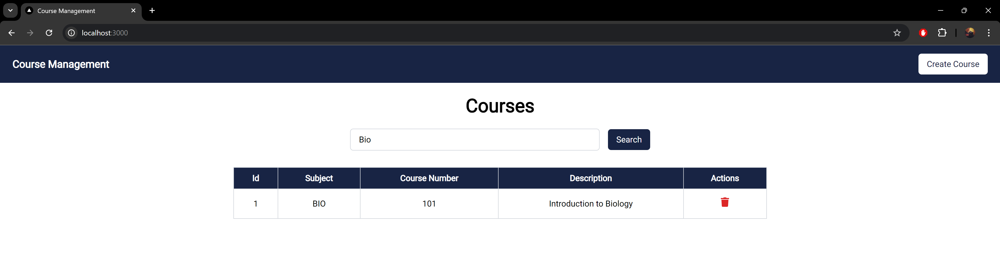
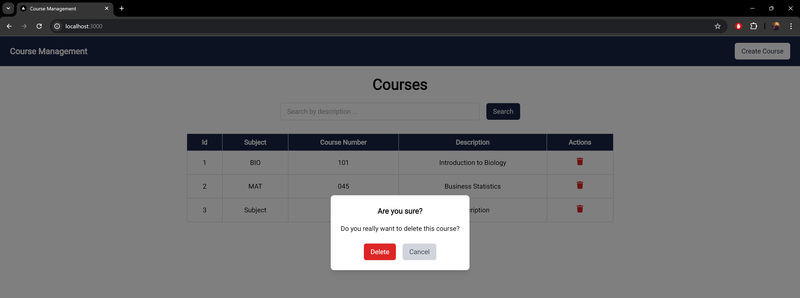
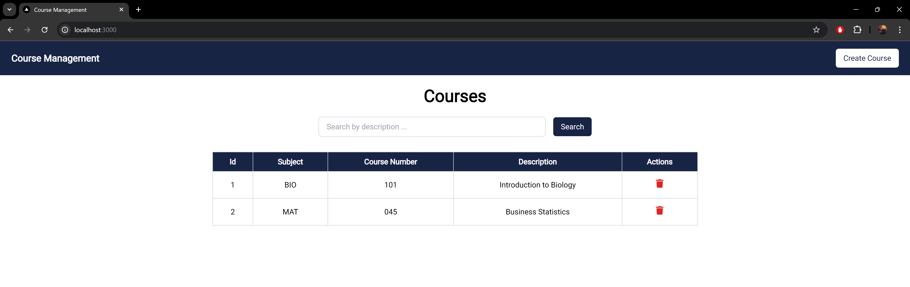
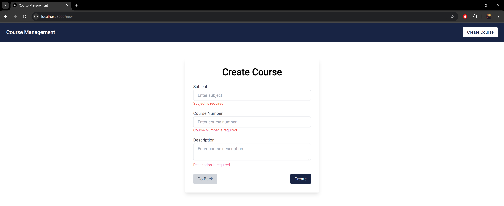
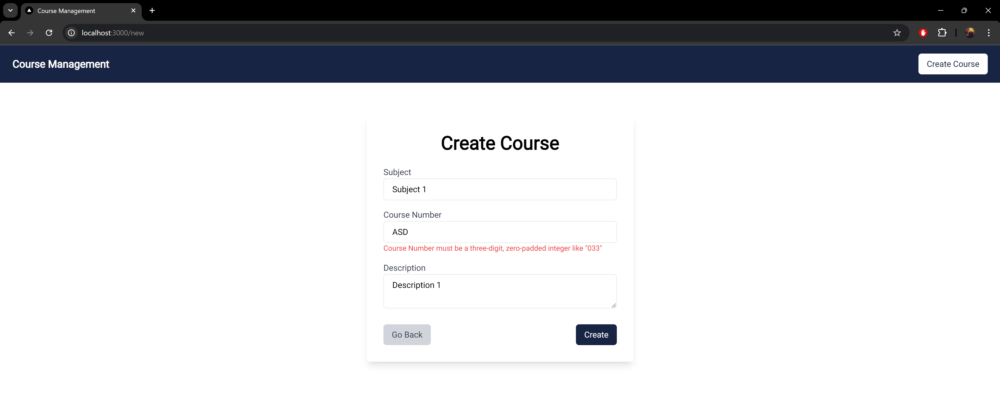
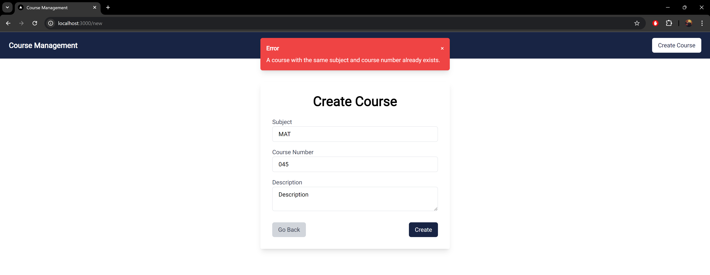
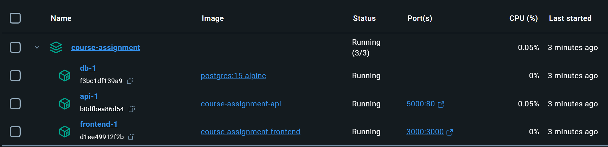

# Course Assignment

This is a full-stack application consisting of a .NET 8 backend API and a Next.js frontend. The application allows users to manage courses, including creating, retrieving, and deleting courses.

## Prerequisites

- [Docker](https://www.docker.com/get-started) installed on your machine.

## Setting Up Environment Variables

1. Create a `.env` file in the root directory.

```bash
touch .env
```

2. Add the following content to the `.env` file:

```env
POSTGRES_USER=your_postgres_username
POSTGRES_PASSWORD=your_postgres_password
POSTGRES_DB=your_database_name
```

3. Important: Ensure that the `.env` file is saved in the same directory as the `docker-compose.yml` file.

## Building and Running the Application

1. Build and start the application using Docker Compose:

```bash
docker-compose up --build
```

- This command will build the Docker images and start all the services defined in the `docker-compose.yml` file.
- The first build may take several minutes.

## Accessing the Application

Once the application is running, you can access it via the following URLs:

- Frontend Application:

```
http://localhost:3000
```

Backend API Swagger UI:

```
http://localhost:5000/swagger
```

**NOTE**: If these ports are in use, you can change them in the `docker-compose.yml` file. However, the backend API is configured to allow requests from the frontend application. If you change the frontend URL or port, you may need to update the CORS settings in the backend API (appsettings.json):

```json
  "CorsSettings": {
    "AllowedOrigins": ["http://localhost:3000", "https://localhost:3000"]
  },
```

You will also need to update the `NEXT_PUBLIC_API_URL` argument for the `frontend` service in the `docker-compose.yml` file.

## Data Persistence

- For testing purposes, the database data does not persist between runs.
- Each time you start the application, a fresh database is initialized.

## Stopping the Application

To stop the application and remove the containers, run:

```bash
docker-compose down
```

---

## Screenshots

1. Fetching all courses



2. Filtering by Description



3. Deleting a Course




4. Creating a Course - validation:





5. Docker Desktop


